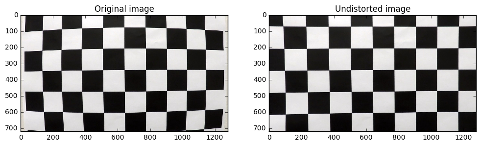
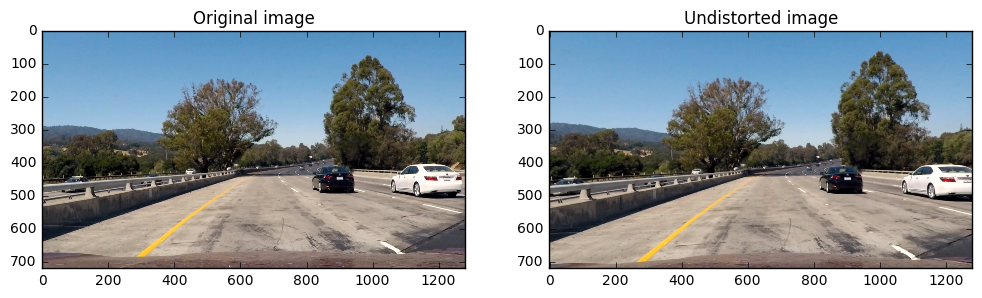
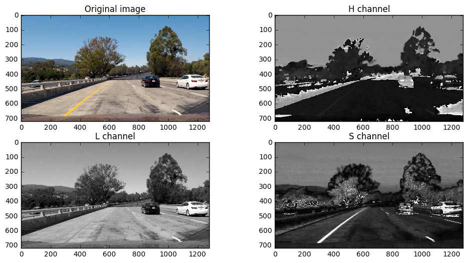
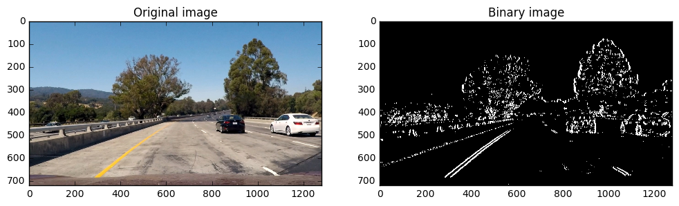
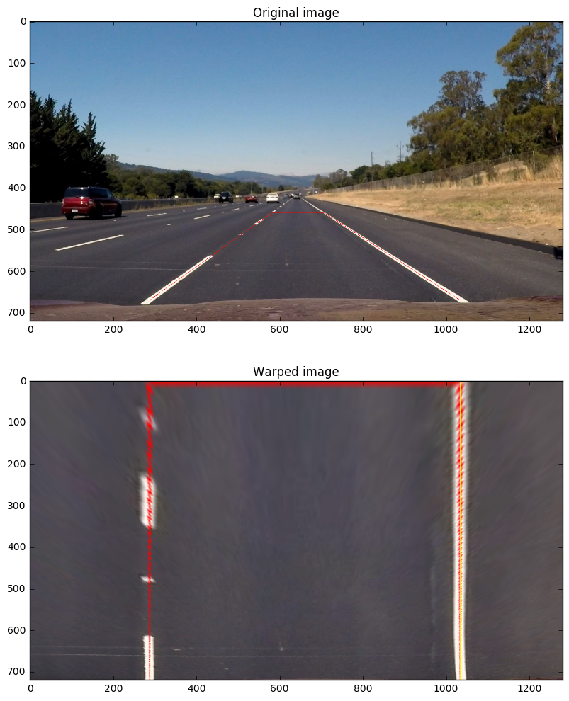
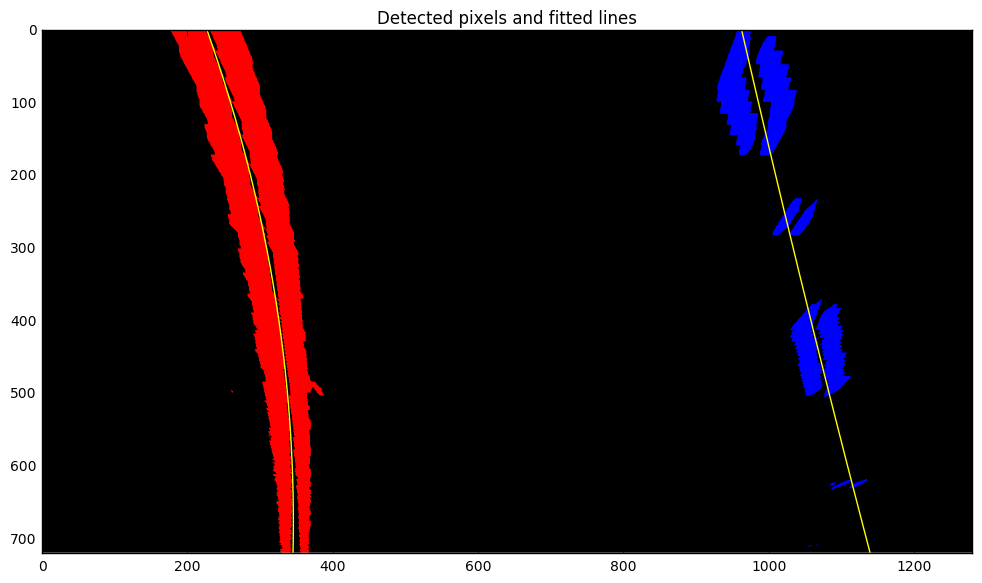
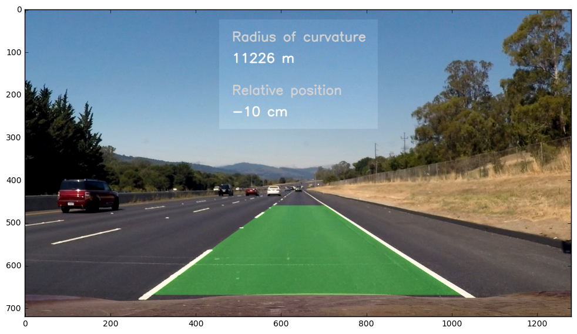

## Writeup Template
### You can use this file as a template for your writeup if you want to submit it as a markdown file, but feel free to use some other method and submit a pdf if you prefer.

---

**Advanced Lane Finding Project**

The goals / steps of this project are the following:

* Compute the camera calibration matrix and distortion coefficients given a set of chessboard images.
* Apply a distortion correction to raw images.
* Use color transforms, gradients, etc., to create a thresholded binary image.
* Apply a perspective transform to rectify binary image ("birds-eye view").
* Detect lane pixels and fit to find the lane boundary.
* Determine the curvature of the lane and vehicle position with respect to center.
* Warp the detected lane boundaries back onto the original image.
* Output visual display of the lane boundaries and numerical estimation of lane curvature and vehicle position.

[//]: # (Image References)

[image1]: ./examples/undistort_output.png "Undistorted"
[image2]: ./test_images/test1.jpg "Road Transformed"
[image3]: ./examples/binary_combo_example.jpg "Binary Example"
[image4]: ./examples/warped_straight_lines.jpg "Warp Example"
[image5]: ./examples/color_fit_lines.jpg "Fit Visual"
[image6]: ./examples/example_output.jpg "Output"
[video1]: ./project_video.mp4 "Video"

## [Rubric](https://review.udacity.com/#!/rubrics/571/view) Points
Below I will consider the rubric points individually and describe how I addressed each point in my implementation.

## Writeup / README

### Camera Calibration

#### 1. Briefly state how you computed the camera matrix and distortion coefficients. Provide an example of a distortion corrected calibration image.

I created function `undistort()` to compute camera matrix and undistort images.

First, I created an array with coordinates of chessboard corners in the real world. Since all of them are located on the plane, the third coordinate of all points are always 0.
The main purpose of this array in our case is to make sure that all detected corners keep the same coordinates in the real world. That's why their coordinates are simply numbers from 0 to 8 for X coordinate and 0 to 5 for Y coordinate.

I created another array with coordinates of detected points on each calibration image using `cv2.findChessboardCorners()`. This function was unable to detect all corners in 3 of 20 calibration images. For me 17 seemed insufficient because some lines seemed to be curved. But because I was not able to create additional images for calibration, I used what I had.

Having sets of coordinates in real world and on calibration images, I used `cv2.calibrateCamera()` to compute camera matrix and distortion coefficients.

Finally I used these coefficients and camera matrix to undistor an image using `cv2.undistort()` function.

Result of undistorting calibration image is below.


### Pipeline (single images)

To simplify my main pipeline I created multiple helping functions.

#### 1. Provide an example of a distortion-corrected image.
To undistort test image, I apply `undistort()` function described above to an image. Steps to undistort an image are described in previous section. Here is an example of undistored the first test image.


#### 2. Describe how (and identify where in your code) you used color transforms, gradients or other methods to create a thresholded binary image.  Provide an example of a binary image result.

To extract information about lane lines I decided to take advantage of HLS color space, because H and S channels provide relatively consistent result under different lighting condition (excessive light or shadows). Saturation channel appeared to be the most useful. Also I applied threshold on L channel, because color information was also pretty informative.



I used the following combination of thresholds:
- Gradient direction threshold for L channel
- Gradient magnitude thresholds for L and S channels
- Gradient magnitude threshold in X direction for L and S channels

Thresholding can be found in my main pipeline function `process_image()`

Here is an example of applying threshold on the first test image.




#### 3. Describe how (and identify where in your code) you performed a perspective transform and provide an example of a transformed image.

I identified 4 points on the original image with straight lane lines. I chose such an image because I thought it  was easier to fine-tune coordinates for this operation with straight section of the lane. I am not totally satisfied with my result because correction for distortion was not perfect and lines were slightly curved. Also I am not totally sure that the car was exactly parallel in both `straight_line` images. I think it is important part of calibration and I would capture those points in a more controlled environment.

To transform perspective of the image I created two helping functions `warp()` to convert original perscpective to the birds-eye view and `unwarp()` to convert it back.

Since I had only one camera postitioned in one place, I decided to hardcode source and destination points as follows:
```
src = np.float32([[287,670],
                  [581,460],
                  [705,460],
                  [1032,670]])

dst = np.float32([[287,720],
                  [287,0],
                  [1032,0],
                  [1032,720]])
```


This resulted in the following source and destination points:

| Source        | Destination   |
|:-------------:|:-------------:|
| 287, 670      | 287, 720      |
| 581, 460      | 287, 0        |
| 705, 460      | 1032, 0       |
| 1032, 670     | 1032, 7200    |

As suggested, I applied my perspective transform to the test image and drew points on both original and warped images to verify that my perspective transformation works.



Red polygon is drawn using source points, and very thin yellow line on the second image is drawn using destination points.

#### 4. Describe how (and identify where in your code) you identified lane-line pixels and fit their positions with a polynomial?

I did this in two functions: `find_lane_edges()` - for initial finding, and `update_lane_edges()` for faster finding. These functions are used inside another function `find_next_fits()` that checks arrays with last N fits and if there are no such arrays, it calls `find_next_fits()` to initialize ones. And if such arrays are present, then it simply updates fits using `update_lane_edges()`.

In the function `find_lane_edges()`, I took binary image from previous step and identified all nonzero pixels in sliding windows and used `np.polyfit()` to fit a polynomial of degree 2.

In the second function, I used coefficients of fitted line from previous frame to faster find and fit all nonzero pixels in current frame. Then I fit a polynomial with the same function.



Another function I used to update fits is `sanity_check_and_update()`. It compares current fits with previous one and returns current one if it is not very different from the previous one, and returns the previous one otherwise.

#### 5. Describe how (and identify where in your code) you calculated the radius of curvature of the lane and the position of the vehicle with respect to center.

I created function `find_curvature()` to find a curvature of the both lane lines. And then I average and return the result.

To calculate relative car position, I use function `ffind_position()` that compares position of the center of the lane line at the bottom of the image with the center of the image (which is assumed to be the center of the car). The distance in centimeters is returned.

#### 6. Provide an example image of your result plotted back down onto the road such that the lane area is identified clearly.

After I obtained drawn birds-eye view of lane region, I use `unwarp()` function to change perspective back (using inverse matrix with the same source and destination pixels as in section 3 of this writeup).

Then I add this (un)warped region, as well as a radius of curvature and car position to the original image. Which gave me the following result.



---

### Pipeline (video)

#### 1. Provide a link to your final video output.  Your pipeline should perform reasonably well on the entire project video (wobbly lines are ok but no catastrophic failures that would cause the car to drive off the road!).

Here's a [link to my video result](./processed_project_video.mp4) or [YouTube video](https://www.youtube.com/watch?v=U-7ratRKlTU)

---

### Discussion

#### 1. Briefly discuss any problems / issues you faced in your implementation of this project.  Where will your pipeline likely fail?  What could you do to make it more robust?

1. Number of calibration images were insufficient because some lines seemed curved after undistorting calibration images. I would create more calibration images.

2. I am not totally satisfied with perspective transformation because I cannot be sure that the car is perfectly parallel to lane lines on `straight_line` images in `test_images` folder. I would capture points for perspective transformation in more controlled environment.

3. The line is sometimes too wobbly, as well as a radius of curvature value. I would solve it with more complex checks when I have more time, because increasing smoothing depth (how many frames are used to predict lane lines) can probably solve this problem, but it will make lines more inert and changing too slow. It is bad because the car should react as quickly as possible to all the changes on the road.
