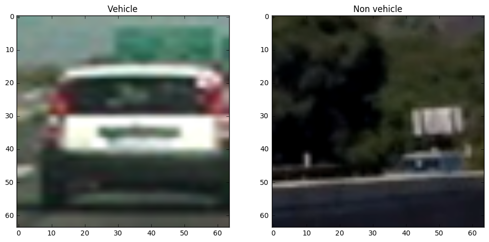
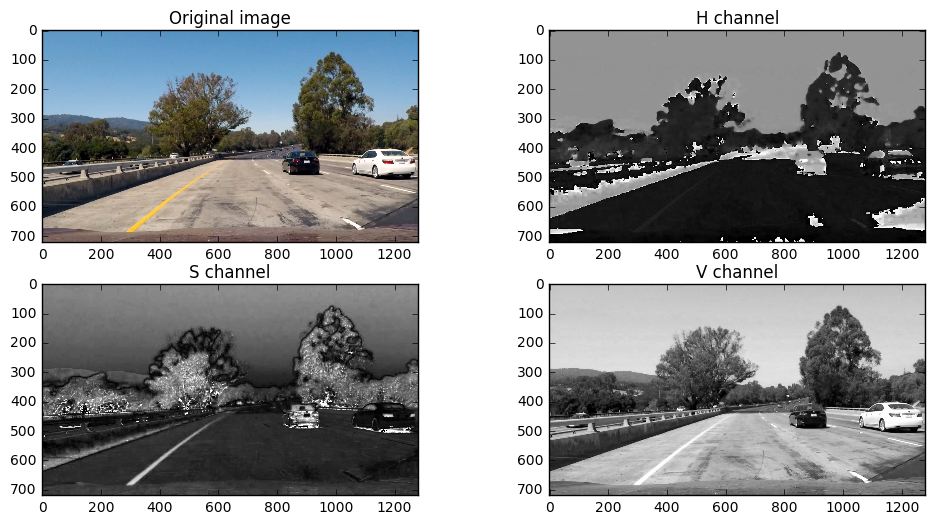
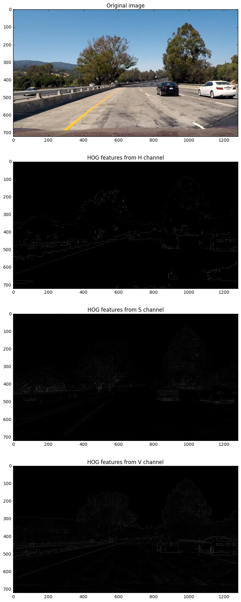
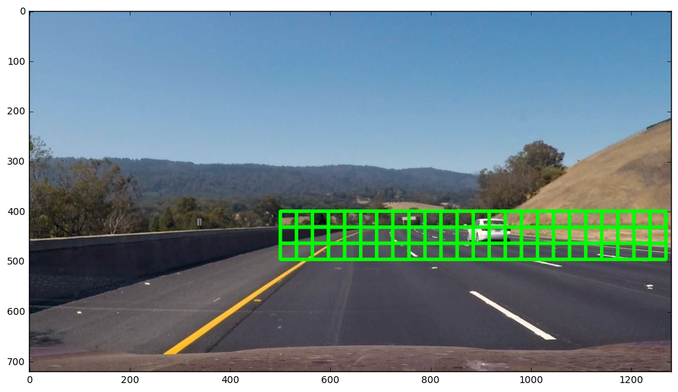
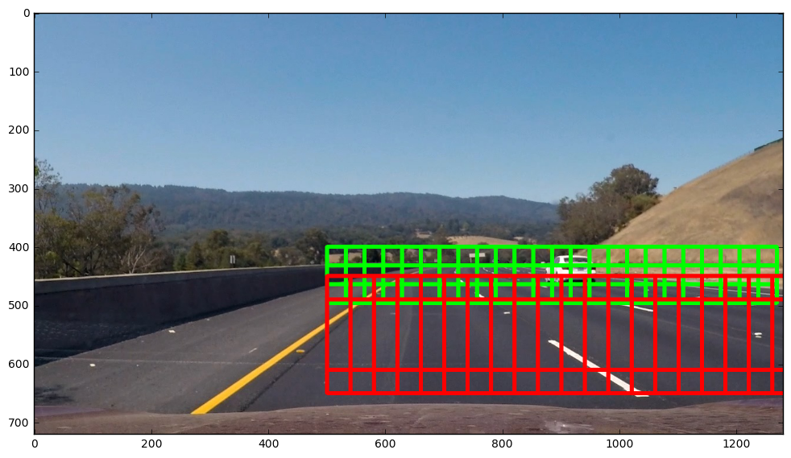
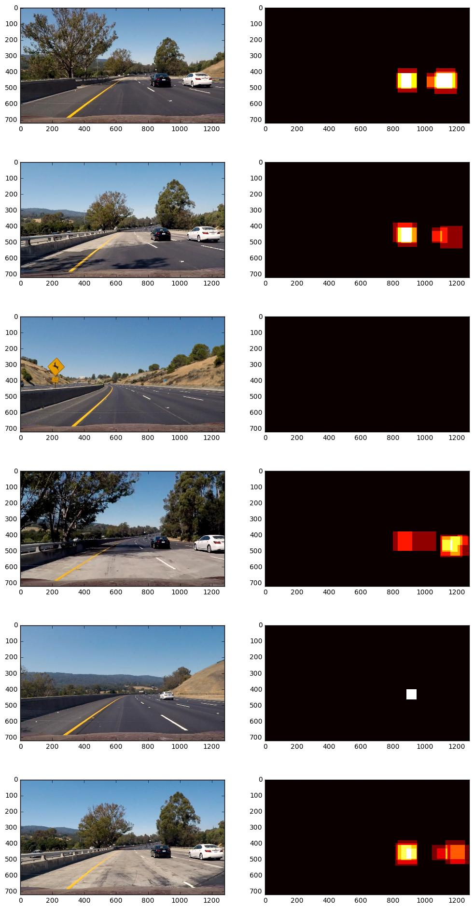
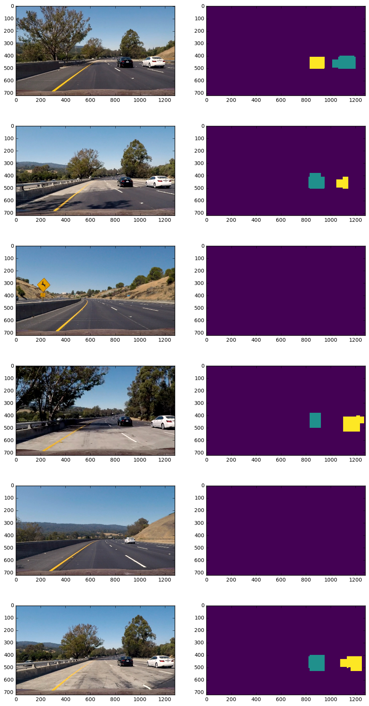
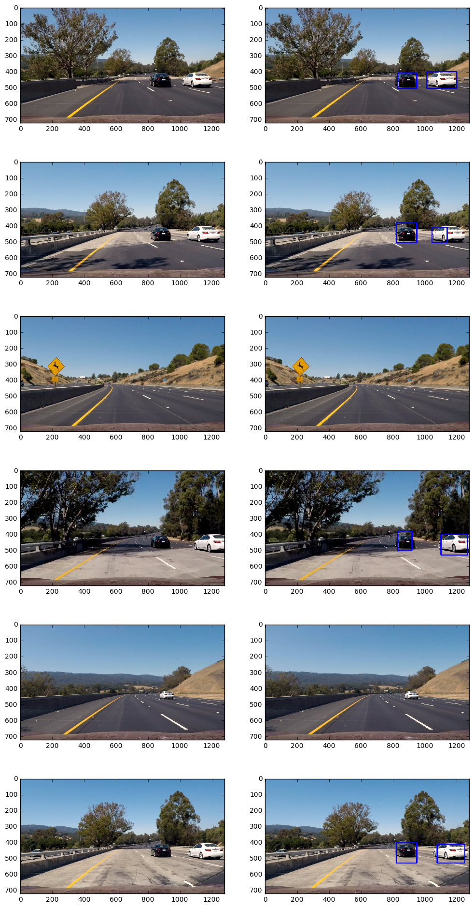

# Vehicle Detection Project

The goals / steps of this project are the following:

* Perform a Histogram of Oriented Gradients (HOG) feature extraction on a labeled training set of images and train a classifier Linear SVM classifier
* Optionally, you can also apply a color transform and append binned color features, as well as histograms of color, to your HOG feature vector.
* Note: for those first two steps don't forget to normalize your features and randomize a selection for training and testing.
* Implement a sliding-window technique and use your trained classifier to search for vehicles in images.
* Run your pipeline on a video stream (start with the test_video.mp4 and later implement on full project_video.mp4) and create a heat map of recurring detections frame by frame to reject outliers and follow detected vehicles.
* Estimate a bounding box for vehicles detected.

## [Rubric](https://review.udacity.com/#!/rubrics/513/view) Points
### Here I will consider the rubric points individually and describe how I addressed each point in my implementation.  

---
### Writeup / README

#### 1. Provide a Writeup / README that includes all the rubric points and how you addressed each one.  You can submit your writeup as markdown or pdf.  [Here](https://github.com/udacity/CarND-Vehicle-Detection/blob/master/writeup_template.md) is a template writeup for this project you can use as a guide and a starting point.  

You're reading it!

### Histogram of Oriented Gradients (HOG)

#### 1. Explain how (and identify where in your code) you extracted HOG features from the training images.

_All the code I wrote for this project is located in the main.ipynb file._

In this project I reused some functions from class. Particularly, I reused function `get_hog_features()` to extract HOG features. It is located in the 2nd cell of the Jupyter notebook. That function calls `hog()` function from `skimage` library.

Before extracting HOG and other features, I loaded datasets (GTI vehicle image database and KITTI vision benchmark suite) into memory, including images of both classes: vehicle and non-vehicles. Below is an example of each class.

For me HSV color space worked the best. Color space as well as other parameters of my pipeline are set up in the cell 3. Below is one of the test images and its channels in HSV color space. V channel seems to contain more details of cars. I tried to use only this channel during HOG extraction, but result on the video became much worse. For this reason I included all channels in HSV color space.

As suggested, I provide an example of HOG features of one of the test images in HSV color space.

As expected features from V channel are most distinctive. However, two other channels also contains important details. I think this is why the model worked better with all channels.

I didn't change other parameters (`orientations`, `pixels_per_cell`, `cells_per_block`) because I got satisfying result with values suggested in class.

#### 2. Explain how you settled on your final choice of HOG parameters.

As I wrote in previous section, I tried different combinations of channels in different color spaces. I empirically chose HSV color space because it gave the best result. So I tried to tune only `hog_channel` parameter. I didn't change `cells_per_block` and `pixels_per_cell` parameters because combination of features gave me satisfying result.

#### 3. Describe how (and identify where in your code) you trained a classifier using your selected HOG features (and color features if you used them).

I trained Linear Support Vector Classifier in 5th cell. I used Grid Search to find optimal `C` parameter.

Features for classifier were loaded in cell 4. I decided to join all examples and split them into training and validation sets (10% for validation). I also rescaled features using `StandardScaler()` from `sklearn` before splitting.

I must note that it is not perfect solution because I suspect that both sets contained a lot of similar images with vehicles (because of GTI datasets). Initially I wanted to use GTI sets for testing and KITTI set for validation. But then I decided to increase training set because I think actual performance is evaluated during video processing somewhat similarly to the Project 3.

So I read from the disk, rescaled images, extracted features, rescaled features as described above and split example into training and testing sets. I fed training test to the classifier and checked performance using `Classifier.score()` method, which gave me ~0.996 accuracy. Which I believe is result of very similar messages in both training and testing sets.

### Sliding Window Search

#### 1. Describe how (and identify where in your code) you implemented a sliding window search.  How did you decide what scales to search and how much to overlap windows?

I implement sliding windows extraction using the same method as in class.
To decrease video processing time I tried to decrease number of windows as much as possible. So I set `x_start_stop = [500, None]` for several reasons.

First, I assumed we seek only for cars that travel in the same direction, because provided datasets contained only rear views of vehicles.

Second, the car was in the left lane, so I didn't expect to detect rear views of a car in roughly the left half of the image.

Also, because it was possible to fit a lot of small windows along the X-axis, it was really important to exclude as much of them as possible. So, I connected sliding window size with apparent size of the vehicles and included only in the top part of the bottom half, because I expected to see `small` cars only somewhere close to horizon.

And of course I didn't include skies and treetops. For this reason I set top limit along Y-axis to ~380-450.

As windows size increased I increased bottom limit along Y-axis

Below are sliding windows with smallest size (green edge) and biggest size (red edge).

#### 2. Show some examples of test images to demonstrate how your pipeline is working.  What did you do to optimize the performance of your classifier?

Demonstration images are in the previous section.

Regarding optimization, I excluded as much as possible. I.e. everything above the horizon. I also used different size of sliding windows for different regions of the image as shown above.

### Video Implementation

#### 1. Provide a link to your final video output.  Your pipeline should perform reasonably well on the entire project video (somewhat wobbly or unstable bounding boxes are ok as long as you are identifying the vehicles most of the time with minimal false positives.)
Here's a [link to my video result](./processed_project_video.mp4) or [YouTube link](https://www.youtube.com/watch?v=XUi7b76nXJU)

#### 2. Describe how (and identify where in your code) you implemented some kind of filter for false positives and some method for combining overlapping bounding boxes.

To detect vehicles, I used Linear Support Vector classifier that predicted the class of each candidate sliding window. Then I used positive candidate windows to create a heatmap of possible vehicles locations using function `add_heat()`. Using heat maps allowed me to deal with overlapping detections (high-confidence detections). For each frame I used detections from this and 4 previous frames, to make resulting video more smooth. Also that let me to increase threshold to exclude some false positives because they are far less consistent than vehicle detections. For this purpose I created global variable `last_heats` that contained heat maps for previous 4 frames.

Another way I used to remove false positives was limiting area of search (I set lowest X to 500, as written in one of the previous sections).

After heat map was created, I used `scipy.ndimage.measurements.label()` to identify individual regions. And then similarly to how we did it in class I added bounding boxes around those regions.

### Here are six test images and their corresponding heatmaps:

### Here is the output of `scipy.ndimage.measurements.label()` on the integrated heatmap from all six frames:
_Images in this and next sections are slightly different from what I get by applying my pipeline to the video, because of heat buffering. For example, the car on 5th image has more chances to be detected if this frame is being processed as part of the video._

### Here the resulting bounding boxes are drawn onto the last frame in the series:

---

### Discussion

#### 1. Briefly discuss any problems / issues you faced in your implementation of this project.  Where will your pipeline likely fail?  What could you do to make it more robust?

That was an interesting and tough project!

The main issue was slow processing of video and it limited number of trials, because often classifier accuracy was high, test images short test video were augmented correctly, but project video had a lot of false positives or missing detections.

I would try to use CNN to classify images because it feel natural to use it in this case. And on the other hand I'll be able to take advantage of GPU on a local computer. I expect better performance.

In order to get more robust solution I would pick training and testing sets more carefully. But for the purposes of this project and in terms of limited data (and honestly, in terms of lack of time), solution I chose seems reasonable to me.
